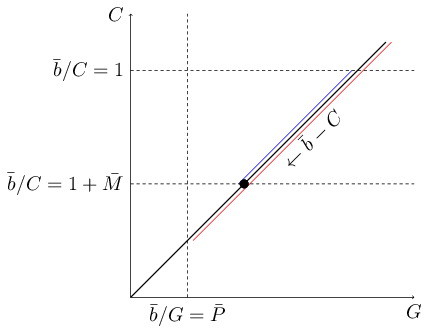
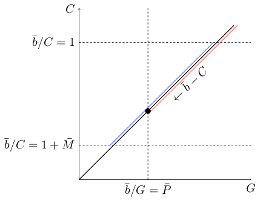
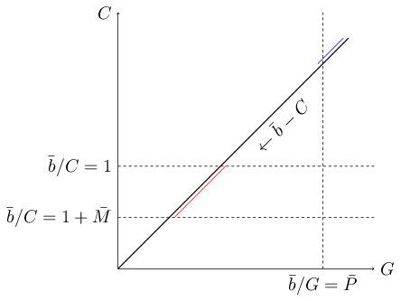

This is the first of a series of posts about the way we optimize our bidding
process. The bidding rules we follow are very principled and their rationale is
not easily described in a short and sweet post because some preliminar
development of the mathematical foundations is in order, so we decided to deploy
this as a series of four posts. The goal is to have the time and space to
achieve a good balance between rigor and intuition while keeping a comfortable
pace. We will as well be posting about different related subjects (Lagrange
duality, stochastic subgradient descent) throughout this year, but in this
series we consider those topics as means to a rather specific end and not as
interesting subjects *per se*.

As you probably already know, Jampp is a demand-side platform (DSP) that manages
hundreds of advertising campaigns for dozens of clients
(advertisers). Advertising inventory coming from multiples sources is
programmatically bought by real-time bidding (RTB) in billions of (mostly
second-price) auctions per day. With each RTB auction, some information about a
user (audience) currently visiting a web site or mobile app is made available:
device id and type, operating system, country, app or site name,
etc. Conditioning on this contextual and other historical information associated
with the device, our bidder has to infer, in less than a few milliseconds, the
probabilities of getting different events of interest (clicks, app installs,
in-app events, etc.) on behalf of clients running campaigns that target the
auction profile. More precisely, the probability of getting those events *given
that* we win the auction and thus are entitled to display one of the many ads
configured for the selected campaign. Effective decision making additionally
requires as input inferences about expected costs and probability of winning the
auction at different bid prices. The inference problem is interesting *per se*
and far from trivial, but here we are mainly concerned with the economical
decisions we have to make having proper estimates at hand, so we take those
estimates as a given from now on. <a id="fnr.1" class="footref" href="#fn.1">1</a>.

As a firm operating in a market economy, maximizing profit is an obvious goal
for Jampp. But it is also evident that we will be constrained in this pursue by
restrictions on the volume and cost of purchases done for the sake of each
advertising campaign. Since an auction often represents an opportunity for more
than one campaign, there is an opportunity cost of assigning it to this instead
of that campaign. Therefore, the opportunity has to be weighted not only by the
expected profit of assigning it to each campaign, but also by the expected
impact of this assignment on the constraint set of each campaign; or, for the
economists out there: the &ldquo;shadow prices&rdquo; of constraints have to be taken into
account. Given the huge number of non-divisible auctions to be considered, this
is a hard combinatorial optimization problem that we can only expect to
approximately solve in a relaxed form. Finding a good relaxation of the
constraints is our main task in what follows, but first we need to establish a
formal setting in order to properly formulate the problem, so we start by
defining its main components.

# Some preliminary definitions

Definition&nbsp;1&nbsp;(Campaign)
We have \(n\) advertising campaigns (\(i, j \in [n] = \{1,\cdots,n\}\)) competing
for the RTB market.

Definition&nbsp;2&nbsp;(Market)
The RTB market consists of \(m\) auctions (\(k \in [m] = \{1,\cdots,m\}\)), each one
characterized by:

-   \(w_k(b)\): the probability of winning the auction by bidding the amount \(b\).

-   \(c_k(b)\): the expected cost (or clearing price) of winning the auction by
    bidding the amount \(b\). <a id="fnr.2" class="footref" href="#fn.2">2</a>

-   \(g_k(i, a)\): for each campaign \(i\), the probability of getting an event of
    interest (a goal) given that we won the auction and displayed ad \(a\).

Bids belong to the interval \((0,\overline{b}]\) while ads belong to the finite
set \([\overline{a}] = \{1,\cdots,\overline{a}\}\). <a id="fnr.3" class="footref" href="#fn.3">3</a> For each auction, we have to decide whether we ignore it or,
otherwise, we assign it to some campaign and chose a bid and an ad for it. This
policy constitutes our bidding strategy:

Definition&nbsp;3&nbsp;(Bidding strategy)
A bidding strategy \( x\from[m]\to[n]\times[\overline{a}]\times(0,\overline{b}]
\cup \{(0,0,0)\}\) is a mapping from auctions to vectors \((i, a, b)\), where \(i\)
is a campaign, \(a\) is an ad and \(b\) is a bid. As a convention, ignored auctions
are mapped to the vector \((0, 0, 0)\). We call \(\mathcal{X}\) the set of all
possible strategies.

We also define some functions that aggregate auctions across campaigns in order
to simplify the exposition of optimization problems in the following sections.

Definition&nbsp;4&nbsp;(Aggregate functions)
Given a strategy \(x\) and a campaign \(i\):

-   \( C_i(x) = \sum_{(k,(j,a,b)) \in x \,\suchthat\, j=i} w_k(b) \cdot c_k(b) \) is
    the aggregate cost function.

-   \( G_i(x) = \sum_{(k,(j,a,b)) \in x \,\suchthat\, j=i} w_k(b) \cdot g_k(j, a) \)
    is the aggregate goal function.

# Two optimal bidding problems: MBFP and FBMP

With the previous definitions in place, we are ready to state a first version of
the problem. Actually, Jampp daily deals with two different types of problem:

1.  Maximum budget, fixed price (MBFP): in this type of contract our client, the
    advertiser, sets an upper bound \(\bar{B_i}\) to the money he wants to spend in
    the campaign. The value of each desired goal (click, install, in-app event,
    etc.) is also informed by the client as a price \(\bar{p_i}\).

2.  Fixed budget, maximum price (FBMP): in this second type of contract the
    advertiser commits herself to pay a total amount \(\bar{b_i}\) in case we
    deliver enough goals to put his unitary price below an upper bound
    \(\bar{P_i}\). As we shall soon see, one more parameter is involved in this
    kind of contract, making it more complex than MBFP.

We now proceed to formally state the MBFP problem:

Definition&nbsp;5&nbsp;(MBFP (Maximum Budget, Fixed Price) Problem)
\[\opt{\max_{x \in \mathcal{X}}}
    {\sum_{i \in [n]} \bar{p_i} G_i(x) - C_i(x)}
    {\Land_{i \in [n]} \bar{p_i} G_i(x) \leq \bar{B_i}}\]
where:

-   \(\bar{p_i}\) is the price paid by the advertiser per each acquired goal.
-   \(\bar{B_i}\) is the total budget allowed by the advertiser.

Similarly, the FBMP is formalized as:

Definition&nbsp;6&nbsp;(FBMP (Fixed Budget, Maximum Price) Problem)
\[\opt{\max_{x \in \mathcal{X}}}
    {\sum_{i \in [n]} \bar{b_i} - C_i(x)}
    {\Land_{i \in [n]} \left(
    	\frac{\bar{b_i}}{G_i(x)} \leq \bar{P_i} \;\land\;
        1 \leq \frac{\bar{b_i}}{C_i(x)} \leq 1 + \bar{M_i} \right)}\]
where:

-   \(\bar{b_i}\) is the total budget paid by the advertiser.
-   \(\bar{P_i}\) is the maximum price the advertiser is willing to pay per goal.
-   \(\bar{M_i}\) is the maximum margin over costs the advertiser is willing to pay.

Notice that, in both cases, the objective is (rather narrowly-minded) our
profit. Despite being expressed &#x2014;for simplicity&rsquo;s sake&#x2014; as a sum over
campaigns of the same kind here, one can imagine a sum over a set composed of
campaigns of both types, MBFP and FBMP. This composability is very important
since it allows us to assess the opportunity cost of assigning an auction to
each matching campaign, and thus to rank the campaigns in a way that makes
economical sense, by using a monetary measure (profit) that works the same no
matter the kind of contract.

We&rsquo;ve already introduced \(\bar{b_i}\) and \(\bar{P_i}\) above, but what is that new
\(\bar{M_i}\) parameter? Well, the fact is that if we&rsquo;re allowed to raise the
effective price per goal up to \(\bar{P_i}\) we will surely do it, since that
means we are buying less inventory and thus lowering our costs. And, given a
guaranteed income of \(\bar{b_i}\), the lower our costs the higher our profit. Of
course, the advertiser won&rsquo;t be very happy when she realizes we&rsquo;re getting a
huge margin of profit by barely meeting her constraints. So the contract
includes a clause to ensure honest work; that is, we aren&rsquo;t allowed to get a
margin over costs higher than \(\bar{M_i}\), even at an effective price lower than
\(\bar{P_i}\). Let a picture speak for 148 words: <a id="fnr.4" class="footref" href="#fn.4">4</a>

On the other hand, we could actually be facing an adverse market. In that case
our margin will be just enough to meet the advertiser maximum price constraint:

Last but not least, a quite nasty thing may happen: infeasibility.

In this case we&rsquo;re unable to achieve a positive profit while, at the same time,
abiding to the maximum price clause. After a few days of running a campaign we
are often able to approximately assess its feasibility; in case it happens to be
infeasible the terms of contract must be renegotiated with the advertiser or,
otherwise, the campaign will have to come to an end.

---

With this we conclude the first delivery of the series. We&rsquo;ve now meticulously
formulated our optimization problems as a first step towards a solution. We
promise to show not one but two practical yet rigorous solutions for MBFP next
time. That will develop the right mindset to tackle the harder FBMP problem in
our third installment. So stay tuned!!!

# Footnotes

<a id="fn.1" href="#fnr.1">1</a> In case you are interested, you can still
read our [previous post](https://geeks.jampp.com/data-science/learning-rtb/) about the inference and learning problem.

<a id="fn.2" href="#fnr.2">2</a> Notice that the expected cost conditional to the
fact that we won the action by bidding \(b\) is always \(b\) for first-price
auctions.

<a id="fn.3" href="#fnr.3">3</a> Not all ads are available
to every campaign, but here we can disregard this fact without loss of
generality.

<a id="fn.4" href="#fnr.4">4</a> Courtesy of emacs `M-x
count-words`
